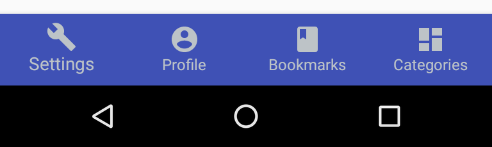

# BottomNavigationView

Android sample project to demonstrate using the new `BottomNavigtionView`, which is newly added to the Android Support Design library.

The widgets works perfectly with 3 items and less, but `trying to display 4 items or more` results in other items being shifted to the screen edgets, which may not be an acceptable design in many cases.

This behavior is automatically triggered, due to an internal property of this widgets, called `ShitMode` being intialized to true and not exposed to the end-user.

Since `shiftmode` is a private field declared in the `BottomNavigationMenuView`, also being an internal class, we use java reflection api to set this property accessible and change its value.

To make thing look more clear, here comes the screenshots for before and after setting the shiftmode to false.

